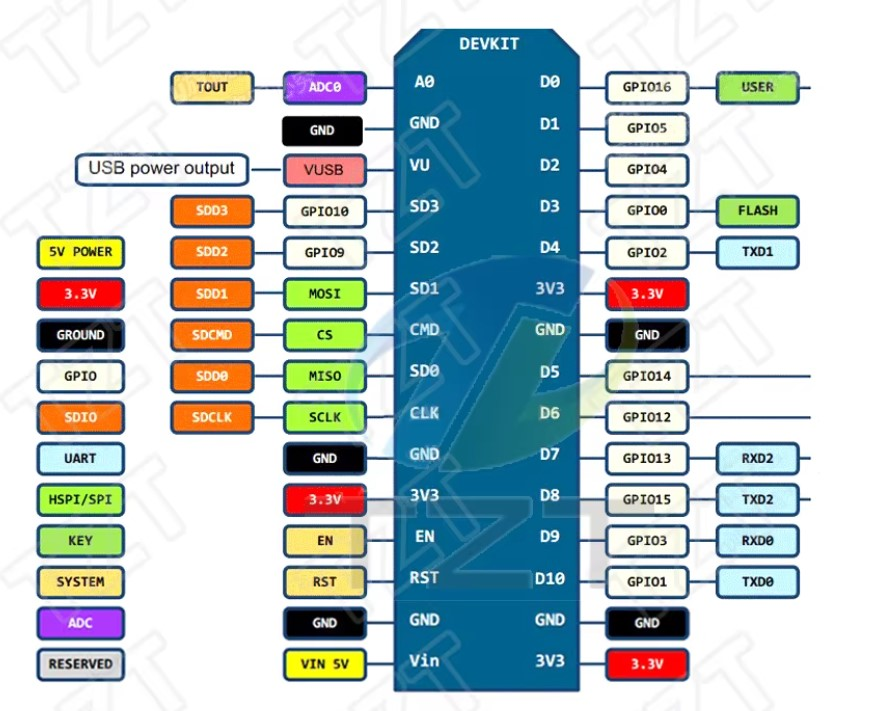

# 🚀 Projetos ESP8266 - NodeMCU v3 CH340

Bem-vindo ao repositório de projetos baseados na placa **NodeMCU v3 CH340** com o chip **ESP8266**! Este é um guia completo para iniciantes e entusiastas que desejam aprender e desenvolver projetos IoT (Internet das Coisas).

---

## 📋 Índice

- [Sobre o Projeto](#sobre-o-projeto)
- [Sobre a Placa NodeMCU v3 CH340](#sobre-a-placa-nodemcu-v3-ch340)
- [Pinagem da Placa](#pinagem-da-placa)
- [Requisitos](#requisitos)
- [Instalação do Driver CH340](#instalação-do-driver-ch340)
- [Configuração do Arduino IDE](#configuração-do-arduino-ide)
- [Lista de Projetos](#lista-de-projetos)
- [Recursos Adicionais](#recursos-adicionais)

---

## 🎯 Sobre o Projeto

Este repositório contém uma coleção de projetos desenvolvidos para a placa **NodeMCU v3 CH340**, baseada no microcontrolador **ESP8266**. Cada projeto possui sua própria documentação detalhada na pasta `projects/`, facilitando o aprendizado progressivo desde conceitos básicos até aplicações mais avançadas.

---

## 🔌 Sobre a Placa NodeMCU v3 CH340

A **NodeMCU v3** é uma placa de desenvolvimento open-source baseada no chip **ESP8266**, ideal para projetos IoT. Ela possui:

### Características principais:
- ✅ **Microcontrolador**: ESP8266 (ESP-12E)
- ✅ **Wi-Fi integrado**: 802.11 b/g/n
- ✅ **Tensão de operação**: 3.3V
- ✅ **Tensão de entrada**: 5V via USB
- ✅ **GPIO**: 11 pinos digitais
- ✅ **ADC**: 1 entrada analógica (0-1V)
- ✅ **PWM**: Suporte em todos os GPIOs
- ✅ **Comunicação**: UART, SPI, I2C
- ✅ **Memória Flash**: 4MB
- ✅ **Conversor USB-Serial**: CH340G
- ✅ **Frequência do Clock**: 80MHz (pode ser aumentado para 160MHz)

### Vantagens:
- 🌐 Conectividade Wi-Fi nativa
- 💰 Baixo custo
- 🔧 Fácil programação via Arduino IDE
- 🔌 Conexão USB direta (não precisa de conversor externo)
- 📚 Grande comunidade e vasta documentação

---

## 📌 Pinagem da Placa

Entender a pinagem é essencial para conectar sensores, atuadores e outros componentes. Consulte o diagrama abaixo:



### Mapeamento de Pinos:

| Pino NodeMCU | GPIO ESP8266 | Função Especial |
|--------------|--------------|-----------------|
| D0           | GPIO16       | Wake up         |
| D1           | GPIO5        | I2C (SCL)       |
| D2           | GPIO4        | I2C (SDA)       |
| D3           | GPIO0        | Flash           |
| D4           | GPIO2        | LED integrado   |
| D5           | GPIO14       | SPI (SCK)       |
| D6           | GPIO12       | SPI (MISO)      |
| D7           | GPIO13       | SPI (MOSI)      |
| D8           | GPIO15       | SPI (CS)        |
| D9           | GPIO3        | RX (UART)       |
| D10          | GPIO1        | TX (UART)       |
| A0           | ADC0         | Entrada Analógica (0-1V) |

⚠️ **Importante**: 
- A placa opera em **3.3V** nos pinos GPIO
- O pino analógico A0 suporta apenas **0-1V** (não conecte 5V!)
- Alguns pinos têm funções especiais e devem ser usados com cuidado durante o boot

---

## 📦 Requisitos

Antes de começar, você precisará de:

### Hardware:
- 🔌 Placa NodeMCU v3 CH340
- 🔄 Cabo USB Micro-B (para programação e alimentação)
- 💻 Computador (Windows, Linux ou macOS)

### Software:
- 🛠️ Arduino IDE (versão 1.8.x ou superior)
- 📡 Driver CH340 (para comunicação USB)
- 📚 Biblioteca ESP8266 para Arduino IDE

---

## 🔧 Instalação do Driver CH340

A placa NodeMCU v3 utiliza o chip **CH340G** como conversor USB-Serial. Na maioria dos sistemas operacionais modernos, o driver é instalado automaticamente, mas caso não funcione, siga os passos abaixo:

### Windows:

1. **Baixe o driver**: [📥 Driver CH340 (Incluído neste repositório)](assets/driver-ch341ser.ZIP)
2. Extraia o arquivo ZIP
3. Execute o instalador correspondente ao seu sistema:
   - `CH341SER.EXE` para Windows
4. Siga as instruções na tela
5. Reinicie o computador (se solicitado)
6. Conecte a placa NodeMCU via USB
7. Verifique se foi reconhecida em `Gerenciador de Dispositivos > Portas (COM e LPT)`

### Linux:

Na maioria das distribuições Linux, o driver já vem integrado ao kernel. Caso necessário:

```bash
sudo apt-get install linux-headers-$(uname -r)
```

### macOS:

Baixe o driver específico para macOS no [site oficial do fabricante](https://www.wch-ic.com/downloads/CH341SER_MAC_ZIP.html).

### Verificação:

Após instalar o driver, conecte a placa e verifique:
- **Windows**: `Gerenciador de Dispositivos` - deve aparecer como `USB-SERIAL CH340 (COMx)`
- **Linux/macOS**: Execute `ls /dev/tty*` - deve aparecer algo como `/dev/ttyUSB0` ou `/dev/cu.wchusbserial`

---

## ⚙️ Configuração do Arduino IDE

### Passo 1: Download e Instalação do Arduino IDE

1. Acesse o site oficial: [🔗 https://www.arduino.cc/en/software](https://www.arduino.cc/en/software)
2. Baixe a versão adequada para seu sistema operacional
3. Instale seguindo as instruções do instalador
4. Execute o Arduino IDE

### Passo 2: Adicionar Suporte ao ESP8266

1. **Abra o Arduino IDE**

2. **Acesse as Preferências:**
   - Menu: `Arquivo` > `Preferências` (ou `File` > `Preferences`)

3. **Adicione a URL do gerenciador de placas:**
   - No campo **"URLs Adicionais para Gerenciadores de Placas"**, cole a seguinte URL:
   
   ```
   http://arduino.esp8266.com/stable/package_esp8266com_index.json
   ```
   
   - Se já houver outras URLs, separe-as com vírgula ou clique no ícone de janela ao lado do campo para adicionar em uma nova linha
   - Clique em **OK**

4. **Instale a biblioteca ESP8266:**
   - Menu: `Ferramentas` > `Placa` > `Gerenciador de Placas...` (ou `Tools` > `Board` > `Boards Manager...`)
   - Na barra de pesquisa, digite: **esp8266**
   - Localize **"esp8266 by ESP8266 Community"**
   - Clique em **Instalar**
   - Aguarde o download e instalação (pode demorar alguns minutos)
   - Clique em **Fechar**

### Passo 3: Selecionar a Placa

1. **Selecione a placa:**
   - Menu: `Ferramentas` > `Placa` > `ESP8266 Boards` > **`Generic ESP8266 Module`**
   - Caso tenha erros de compilação, altere a placa para ou "NodeMCU 1.0 (ESP-12E Module)" ou "NodeMCU 0.9 (ESP-12 Module)
   
2. **Configure os parâmetros da placa:**
   - `Ferramentas` > `Upload Speed`: **115200**
   - `Ferramentas` > `CPU Frequency`: **80 MHz**
   - `Ferramentas` > `Flash Size`: **4MB (FS:2MB OTA:~1019KB)`** (ou similar)
   - `Ferramentas` > `Port`: Selecione a porta COM onde a placa está conectada (ex: COM3, /dev/ttyUSB0)

### Passo 4: Teste a Configuração

Vamos fazer um teste simples para garantir que tudo está funcionando:

1. **Abra o exemplo Blink:**
   - Menu: `Arquivo` > `Exemplos` > `ESP8266` > `Blink`

2. **Carregue o código:**
   - Clique no botão **Upload** (seta para direita) ou pressione `Ctrl+U`
   - Aguarde a compilação e upload
   - Você verá mensagens no console indicando o progresso

3. **Resultado:**
   - O LED integrado da placa (conectado ao GPIO2/D4) deve piscar
   - Se funcionar, parabéns! Sua configuração está correta! 🎉

### Dicas de Troubleshooting:

❌ **Erro de upload / Porta não detectada:**
- Verifique se o driver CH340 está instalado corretamente
- Tente outro cabo USB (alguns cabos são apenas para carregamento)
- Reinicie o Arduino IDE
- No Windows, verifique o Gerenciador de Dispositivos

❌ **Erro "espcomm_sync failed":**
- Segure o botão **FLASH** na placa durante o upload
- Tente reduzir a velocidade de upload para 57600

❌ **Placa não entra em modo de programação:**
- Desconecte e reconecte o cabo USB
- Pressione o botão **RST** (reset) na placa antes do upload

---

## 📂 Lista de Projetos

Abaixo estão listados todos os projetos disponíveis neste repositório. Cada projeto possui documentação detalhada em sua respectiva pasta.

> � **Dica**: Comece pelo **Basic Test** para validar sua configuração, depois explore os projetos de alarme!

---

### 💡 [Basic Test - Teste Básico LED](projects/basic-test/)

Projeto inicial para testar a placa e validar a configuração do Arduino IDE. Faz o LED integrado piscar.

---

### � [Alarme v1 - Detecção de Presença](projects/alarme-v1/)

Sistema de alarme com sensor ultrassônico HC-SR04. Conversão do projeto original do **Manual do Mundo** para ESP8266.

---

### 🌐 [Alarme v2 - Interface Web IoT](projects/alarme-v2/)

**Evolução do Alarme v1** com interface web completa! Controle o alarme remotamente via Wi-Fi usando qualquer navegador.

---

### 🕹️ [Joystick Display - Monitor de Joystick](projects/joystick-display/)

Ferramenta de teste para módulos joystick analógico com visualização em display OLED e interface web em tempo real.

---

### 🔧 [Servo Test - Testador de Servo Motores](projects/servo-test-v1/)

Sistema de teste e controle para servo motores com interface web, detecção automática de tipo e PWM otimizado para ESP8266.

---

## 🎯 Objetivo do Repositório

Este repositório nasceu do objetivo pessoal de **converter projetos Arduino para ESP8266**, explorando os recursos adicionais da placa, especialmente o **Wi-Fi integrado**. Após estudar com Arduino, este repositório documenta a jornada de aprendizado com o ESP8266, mantendo a compatibilidade com projetos clássicos e adicionando funcionalidades IoT.

> 🚧 **Novos projetos em desenvolvimento!** Mais conversões e projetos originais serão adicionados regularmente.

---

## 📚 Recursos Adicionais

### Link para comprar a placa
- [NodeMcu v3 CH340 - Esp8266 nodemcu](https://pt.aliexpress.com/item/1005008485713481.html)

### Documentação Oficial:
- [📖 Documentação ESP8266 Arduino Core](https://arduino-esp8266.readthedocs.io/)
- [📖 Datasheet ESP8266](https://www.espressif.com/sites/default/files/documentation/0a-esp8266ex_datasheet_en.pdf)
- [🔧 Arduino IDE](https://www.arduino.cc/en/Guide)

### Comunidades e Fóruns:
- [💬 Fórum Arduino](https://forum.arduino.cc/)
- [💬 ESP8266 Community Forum](https://www.esp8266.com/)
- [🐙 GitHub ESP8266 Arduino Core](https://github.com/esp8266/Arduino)

### Tutoriais Recomendados:
- [🎓 Random Nerd Tutorials - ESP8266](https://randomnerdtutorials.com/projects-esp8266/)
- [🎓 ESP8266 Getting Started](https://tttapa.github.io/ESP8266/Chap01%20-%20ESP8266.html)

---

## 🤝 Contribuindo

Contribuições são bem-vindas! Se você desenvolveu um projeto interessante com ESP8266, sinta-se à vontade para compartilhar.

---

## 📝 Licença

Este projeto é distribuído sob a licença MIT. Sinta-se livre para usar, modificar e distribuir.

---

## ⚡ Dicas Finais para Iniciantes

1. **🔋 Alimentação**: A placa pode ser alimentada via USB (5V) ou pelo pino VIN (5-12V). Os pinos GPIO operam em 3.3V!

2. **🔒 Proteção**: Sempre desconecte a alimentação antes de fazer conexões de hardware.

3. **📖 Leia a documentação**: Cada projeto tem seu README com instruções específicas.

4. **🧪 Experimente**: Não tenha medo de testar e modificar os códigos!

5. **🌐 Wi-Fi**: O ESP8266 pode operar como cliente (conectar a uma rede) ou Access Point (criar sua própria rede).

6. **💾 Memória**: Tome cuidado com o uso de memória - o ESP8266 tem limitações de RAM.

---

**Desenvolvido com ❤️ para a comunidade maker!**
