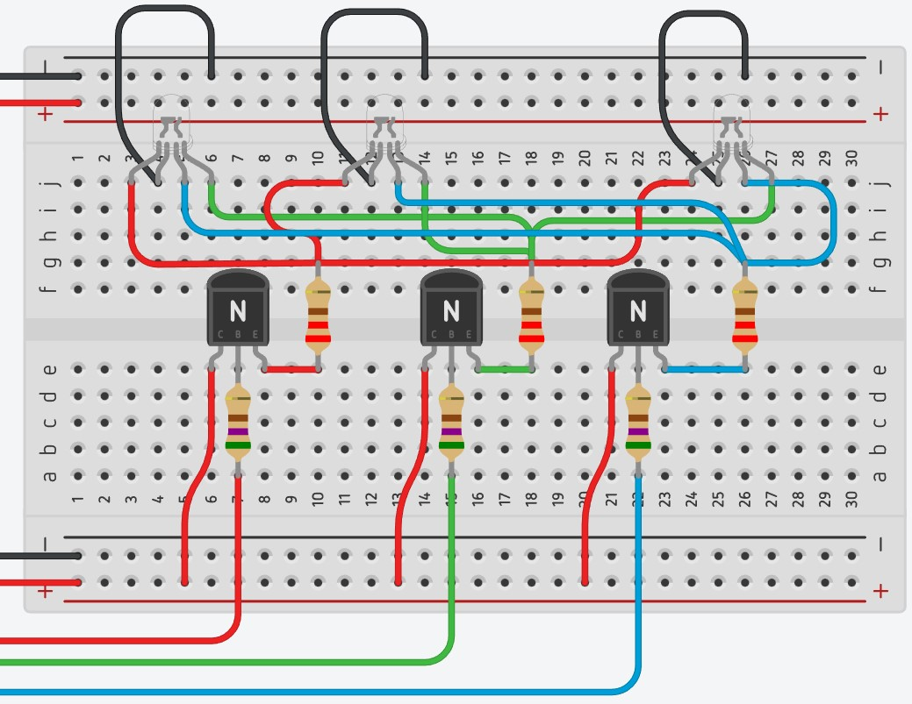
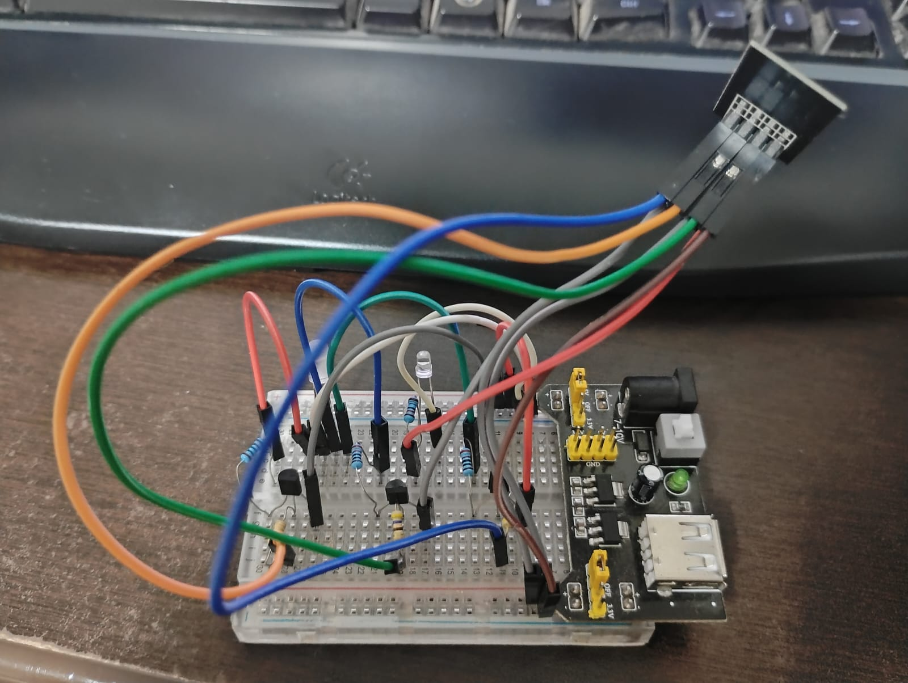
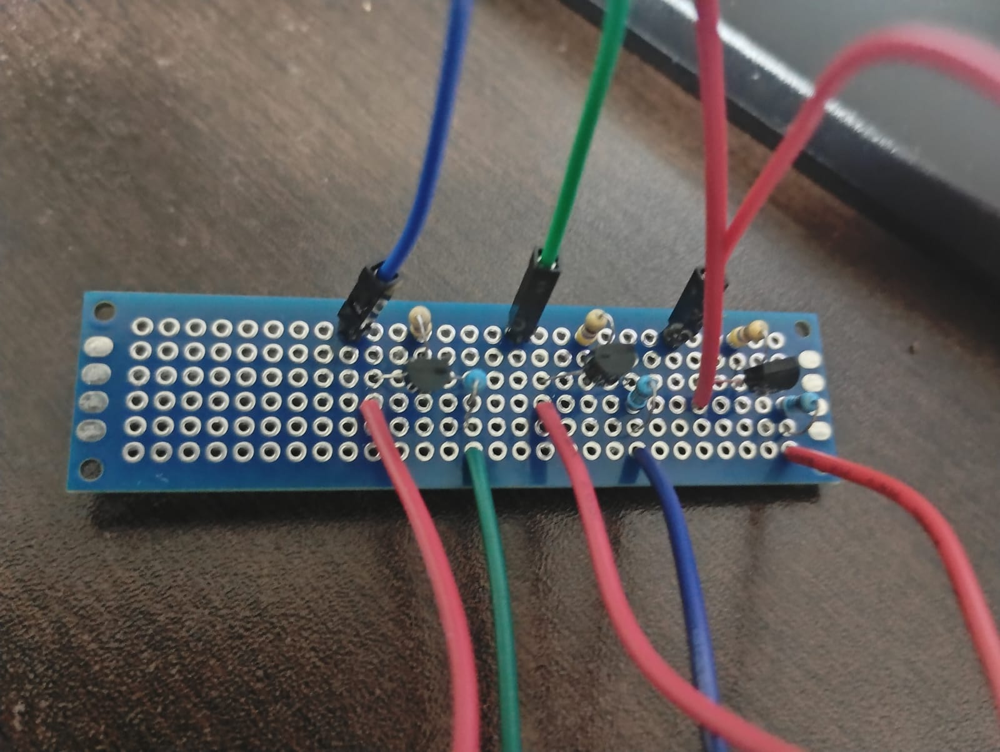
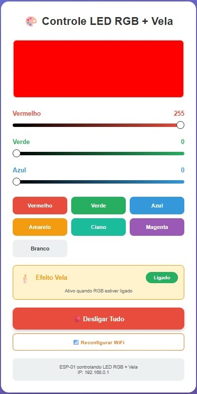

# 🎨 Controle RGB + LED Vela com ESP-01

Sistema de controle de LEDs RGB com efeito de vela via WiFi, desenvolvido para ESP-01 (ESP8266).

---

## 📋 Índice

- [Características](#características)
- [Componentes Necessários](#componentes-necessários)
- [Esquema de Conexões](#esquema-de-conexões)
- [Pinagem ESP-01](#pinagem-esp-01)
- [Funcionalidades](#funcionalidades)
- [Instalação e Compilação](#instalação-e-compilação)
- [Configuração WiFi](#configuração-wifi)
- [Desenvolvedor](#desenvolvedor)

---

## 📸 Galeria

### Protótipo no Tinkercad


### Esquema do Circuito


### Montagem na PCB


### Interface Web



---

## ✨ Características

- ✅ Controle de até 4 LEDs RGB em paralelo via PWM
- ✅ LED branco com 7 efeitos diferentes de vela realistas
- ✅ Interface web responsiva e moderna
- ✅ Configuração WiFi dinâmica (portal captivo)
- ✅ Controle individual de cada canal RGB (0-255)
- ✅ Cores pré-definidas (vermelho, verde, azul, amarelo, ciano, magenta, branco)
- ✅ Botão liga/desliga geral
- ✅ Ativação/desativação do efeito vela
- ✅ IP automático via DHCP
- ✅ Reset de configuração WiFi via interface

---

## 🔧 Componentes Necessários

### Microcontrolador
- **1x ESP-01** (ESP8266)

### Transistores
- **3x 2N2222** (NPN) - Controle de canais RGB

### Resistores
- **3x 470Ω** (amarelo-roxo-marrom) - Proteção das bases dos transistores
- **3x 220Ω** (vermelho-vermelho-marrom) - Limitação de corrente dos LEDs RGB
- **1x 220Ω** (vermelho-vermelho-marrom) - Limitação de corrente do LED branco

### LEDs
- **4x LED RGB de Catodo Comum** (4 pinos)
- **1x LED Branco** (5mm)

### Alimentação
- **Fonte 9V / 2A** - Para os LEDs RGB (coletores dos transistores)
- **Fonte 3.3V** - Para o ESP-01 (regulador ou conversor)

### Outros
- **1x Protoboard** ou PCB personalizada
- **Jumpers** (fios de conexão)
- **Conectores** (opcional, para facilitar manutenção)

### ✅ Configuração Segura:
- **6 a 8 LEDs RGB** em paralelo
- Mantém os transistores em temperatura segura
- Permite uso prolongado sem aquecimento excessivo

## 🔌 Esquema de Conexões

### Alimentação
```
Fonte 9V (+)  → Coletores dos transistores Q1, Q2, Q3
Fonte 3.3V (+) → VCC do ESP-01 (Pino 8)
Fonte 3.3V (+) → EN do ESP-01 (Pino 6)
GND Comum     → GND do ESP-01 (Pino 1) + Emissores + Catodos dos LEDs
```

### Canal Vermelho (Q1)
```
ESP-01 GPIO 0 (Pino 3) → Resistor 470Ω → Base Q1
Fonte 9V → Coletor Q1
Emissor Q1 → Resistor 220Ω → Pino R de todos os LEDs RGB
```

### Canal Verde (Q2)
```
ESP-01 GPIO 2 (Pino 2) → Resistor 470Ω → Base Q2
Fonte 9V → Coletor Q2
Emissor Q2 → Resistor 220Ω → Pino G de todos os LEDs RGB
```

### Canal Azul (Q3)
```
ESP-01 GPIO 3 (Pino 4/RXD) → Resistor 470Ω → Base Q3
Fonte 9V → Coletor Q3
Emissor Q3 → Resistor 220Ω → Pino B de todos os LEDs RGB
```

### LED Vela
```
ESP-01 GPIO 1 (Pino 5/TXD) → Resistor 220Ω → LED Branco (+) → LED (-) → GND
```

### LEDs RGB
```
Cada LED RGB:
- Pino R → Conectado em paralelo ao canal vermelho
- Pino G → Conectado em paralelo ao canal verde
- Pino B → Conectado em paralelo ao canal azul
- Pino Catodo (-) → GND comum
```

---

## 📍 Pinagem ESP-01

### Vista Superior
```
        ┌─────────────┐
        │  ESP-01     │
        │   ╔═══╗     │
        │   ║ANT║     │
        │   ╚═══╝     │
  ┌─────┴─────────────┴─────┐
  │ GND  GPIO2 GPIO0  RXD   │  ← Fila 1 (pinos 1-4)
  │ TXD   EN    RST   VCC   │  ← Fila 2 (pinos 5-8)
  └─────────────────────────┘
```

### Mapeamento de Pinos

| Pino Físico | Nome      | Função Especial          |
|-------------|-----------|--------------------------|
| 1           | GND       | Ground                   |
| 2           | GPIO2     | TX1, I2C (SDA)           |
| 3           | GPIO0     | Flash/Boot               |
| 4           | GPIO3     | RX (UART)                |
| 5           | GPIO1     | TX (UART)                |
| 6           | EN        | Chip Enable              |
| 7           | RST       | Reset                    |
| 8           | VCC       | Power Supply (3.3V)      |

### ⚠️ Observações Importantes
- **GPIO 1 (TXD)** e **GPIO 3 (RXD)** são pinos de comunicação serial
- **Desconecte** os fios desses pinos durante o upload do código
- **Reconecte** após o upload estar completo
- GPIO 0 deve estar em HIGH durante operação normal (já configurado no código)

---

## 🎯 Funcionalidades

### Controle RGB
- **Sliders individuais** para cada canal (Vermelho, Verde, Azul)
- **Valores de 0 a 255** para cada cor
- **Preview em tempo real** da cor selecionada
- **7 cores pré-definidas**: Vermelho, Verde, Azul, Amarelo, Ciano, Magenta, Branco

### Efeito Vela
O LED branco simula uma vela realista com **7 tipos de comportamento**:

1. **Rajada Extrema** - Quase apaga completamente (rajada forte de vento)
2. **Vento Forte** - Oscila bastante entre baixo e médio
3. **Vento Médio** - Oscila entre médio e alto
4. **Vento Fraco** - Fica mais no alto com pequenas variações
5. **Chama Estável** - Quase não varia, fica bem alto
6. **Chama Crescendo** - Aumenta gradualmente o brilho
7. **Piscadas Rápidas** - Pisca rápido várias vezes

O sistema **alterna automaticamente** entre os efeitos em tempos aleatórios, criando um comportamento extremamente realista.

### Botões de Controle
- **🟢 Ligar / 🔴 Desligar Tudo** - Liga em branco ou desliga completamente
- **Efeito Vela Ligado/Desligado** - Ativa/desativa o efeito da vela
- **📶 Reconfigurar WiFi** - Reseta as configurações de rede

---

## 💻 Instalação e Compilação

### Requisitos
- **Arduino IDE 1.8.x** ou superior
- **Placa ESP8266** instalada no Arduino IDE
- **Biblioteca WiFiManager** (tzapu)

### Passo 1: Instalar Suporte ao ESP8266
1. Abra Arduino IDE
2. Vá em **Arquivo → Preferências**
3. Em "URLs Adicionais de Gerenciadores de Placas", adicione:
   ```
   http://arduino.esp8266.com/stable/package_esp8266com_index.json
   ```
4. Vá em **Ferramentas → Placa → Gerenciador de Placas**
5. Procure por **esp8266** e instale

### Passo 2: Instalar Biblioteca WiFiManager
1. Vá em **Sketch → Incluir Biblioteca → Gerenciar Bibliotecas**
2. Procure por **WiFiManager**
3. Instale **WiFiManager by tzapu**

### Passo 3: Configurar a Placa
1. **Ferramentas → Placa** → Selecione **Generic ESP8266 Module**
2. Configurações recomendadas:
   - **Flash Size**: 1MB (FS:64KB OTA:~470KB)
   - **CPU Frequency**: 80 MHz
   - **Upload Speed**: 115200
   - **Flash Mode**: DIO

### Passo 4: Conexão para Upload
Para fazer upload do código no ESP-01, você precisa de um **adaptador USB-Serial** (como CH340 ou FTDI).

**Modo de Programação:**
```
ESP-01        Adaptador
GND    ─────  GND
VCC    ─────  3.3V
TX     ─────  RX
RX     ─────  TX
GPIO0  ─────  GND (apenas durante upload)
EN     ─────  3.3V
```

**⚠️ IMPORTANTE:**
- **Desconecte GPIO 1 (TXD) e GPIO 3 (RXD)** dos transistores durante o upload
- **Conecte GPIO 0 ao GND** para entrar em modo de programação
- Após upload, **desconecte GPIO 0 do GND**
- **Reconecte GPIO 1 e GPIO 3** aos transistores

### Passo 5: Upload do Código
1. Conecte o ESP-01 no modo de programação
2. Abra o arquivo `.ino` no Arduino IDE
3. Selecione a porta COM correta em **Ferramentas → Porta**
4. Clique em **Upload**
5. Aguarde a mensagem "Hard resetting via RTS pin..."
6. Desconecte GPIO 0 do GND
7. Reconecte os fios dos transistores
8. Pressione o botão **Reset** (ou desconecte e reconecte a alimentação)

---

## 📶 Configuração WiFi

O sistema utiliza **portal captivo** para configuração inicial do WiFi.

### Primeira Conexão

1. **Ligue o ESP-01**
   - Aguarde ~10 segundos

2. **Procure a rede WiFi** no seu dispositivo
   - Nome da rede: **ESP-LED-Config**
   - Sem senha

3. **Conecte-se à rede**
   - O portal de configuração deve abrir automaticamente
   - Se não abrir, acesse: `http://192.168.4.1`

4. **Configure o WiFi**
   - Clique em **Configure WiFi**
   - Selecione sua rede WiFi
   - Digite a senha
   - Clique em **Save**

5. **Aguarde a conexão**
   - O ESP reiniciará automaticamente
   - Conectará à sua rede WiFi

### Descobrindo o IP do ESP

**Opção 1 - App Fing (Recomendado)**
1. Baixe o app **Fing** (Android/iOS)
2. Escaneie a rede
3. Procure por **"Espressif"** ou **"esp-led-rgb"**

**Opção 2 - Roteador**
1. Acesse seu roteador (geralmente `192.168.0.1` ou `192.168.1.1`)
2. Vá em **Dispositivos Conectados** ou **DHCP Clients**
3. Procure por **"esp-led-rgb"** ou **ESP**

**Opção 3 - Navegador**
- Tente acessar: `http://esp-led.local` (pode não funcionar em todas as redes)

### Reconfigurar WiFi

Se precisar trocar de rede:
1. Acesse a interface web do ESP
2. Clique no botão **📶 Reconfigurar WiFi**
3. Confirme a ação
4. O ESP reiniciará em modo portal
5. Conecte novamente no **ESP-LED-Config**
6. Configure a nova rede

---

## 🌐 Interface Web

### Acesso
Após conectado à rede WiFi, acesse pelo navegador:
```
http://[IP-DO-ESP]
```

Exemplo: `http://192.168.0.173`

### Recursos da Interface

#### 1. Preview de Cor
- **Quadrado colorido** mostra a cor atual em tempo real
- Atualiza conforme você move os sliders

#### 2. Sliders RGB
- **Vermelho**: 0-255
- **Verde**: 0-255
- **Azul**: 0-255
- Valor numérico exibido ao lado

#### 3. Cores Pré-definidas
Botões de acesso rápido:
- 🔴 **Vermelho** (255, 0, 0)
- 🟢 **Verde** (0, 255, 0)
- 🔵 **Azul** (0, 0, 255)
- 🟡 **Amarelo** (255, 255, 0)
- 🔷 **Ciano** (0, 255, 255)
- 🟣 **Magenta** (255, 0, 255)
- ⚪ **Branco** (255, 255, 255)

#### 4. Controle de Vela
- **🕯️ Efeito Vela**
  - **Ligado**: LED branco com efeito de vela quando RGB estiver ligado
  - **Desligado**: Efeito de vela desativado

#### 5. Controle Geral
- **🟢 Ligar**: Liga todos os LEDs em branco (255, 255, 255)
- **🔴 Desligar Tudo**: Desliga completamente todos os LEDs

#### 6. Configurações
- **📶 Reconfigurar WiFi**: Reseta e reinicia em modo portal
- **IP**: Mostra o endereço IP atual do ESP

---

## 🔧 Solução de Problemas

### LED não desliga completamente
- Verifique se está usando a **versão mais recente** do código
- A função `setRGB()` deve usar `digitalWrite(LOW)` quando r=g=b=0

### LED acende sozinho ao ligar
- Certifique-se de que os pinos estão configurados como **OUTPUT** no início do `setup()`
- O código deve ter `digitalWrite(LOW)` forçado no setup

### Não consigo fazer upload
- **GPIO 0** deve estar conectado ao **GND** durante o upload
- **Desconecte GPIO 1 e GPIO 3** dos transistores
- Verifique se o adaptador USB está em **3.3V** (não 5V!)
- Tente reduzir a velocidade de upload para **57600**

### ESP não aparece na rede WiFi
- Aguarde 30 segundos após ligar
- Verifique se a fonte de 3.3V fornece corrente suficiente (mínimo 250mA)
- Tente resetar as configurações WiFi pelo botão na interface

### Efeito de vela não funciona
- GPIO 1 (TXD) deve estar conectado ao LED branco
- Verifique o resistor de 220Ω no LED branco
- Certifique-se de que o LED RGB está ligado (efeito só ativa quando RGB > 0)

### LEDs muito fracos
- Confirme que está usando **fonte de 9V** (não 5V) nos coletores
- Verifique os resistores: devem ser **220Ω** nos emissores
- Teste com menos LEDs (comece com 1 ou 2)

---

## 📐 Especificações Técnicas

### Corrente por LED (com 9V e 220Ω)
- **Por cor**: ~26mA
- **RGB completo (branco)**: ~78mA por LED
- **4 LEDs em paralelo**: ~312mA total

### Limites do Transistor 2N2222
- **Corrente máxima**: 500mA
- **LEDs suportados**: Até 6 LEDs RGB com brilho máximo
- **Recomendado**: Até 4 LEDs para operação segura

### Consumo Total
- **ESP-01**: ~80mA (pico durante transmissão WiFi)
- **4 LEDs RGB (branco)**: ~312mA
- **LED Vela**: ~20mA
- **Total máximo**: ~412mA (fonte 9V) + 80mA (fonte 3.3V)

---

## 📝 Notas de Desenvolvimento

### Versão
- **v1.0.0** - Versão inicial estável

### Melhorias Futuras
- [ ] Suporte a mDNS (acesso por nome)
- [ ] Modo temporizador (desligar automático)
- [ ] Salvar cor favorita
- [ ] Controle por MQTT
- [ ] Integração com Alexa/Google Home
- [ ] Modos de animação RGB (arco-íris, fade, etc)

---

## 📄 Licença

Este projeto é de código aberto e está disponível sob a licença MIT.

---

## 👨‍💻 Desenvolvedor

**Antônio Abrantes**

- 📧 Email: [seu-email@exemplo.com]
- 💼 LinkedIn: [seu-linkedin]
- 🐙 GitHub: [seu-github]

---

**🎨 Divirta-se com seu sistema de LEDs RGB controlado por WiFi! 🌈**
