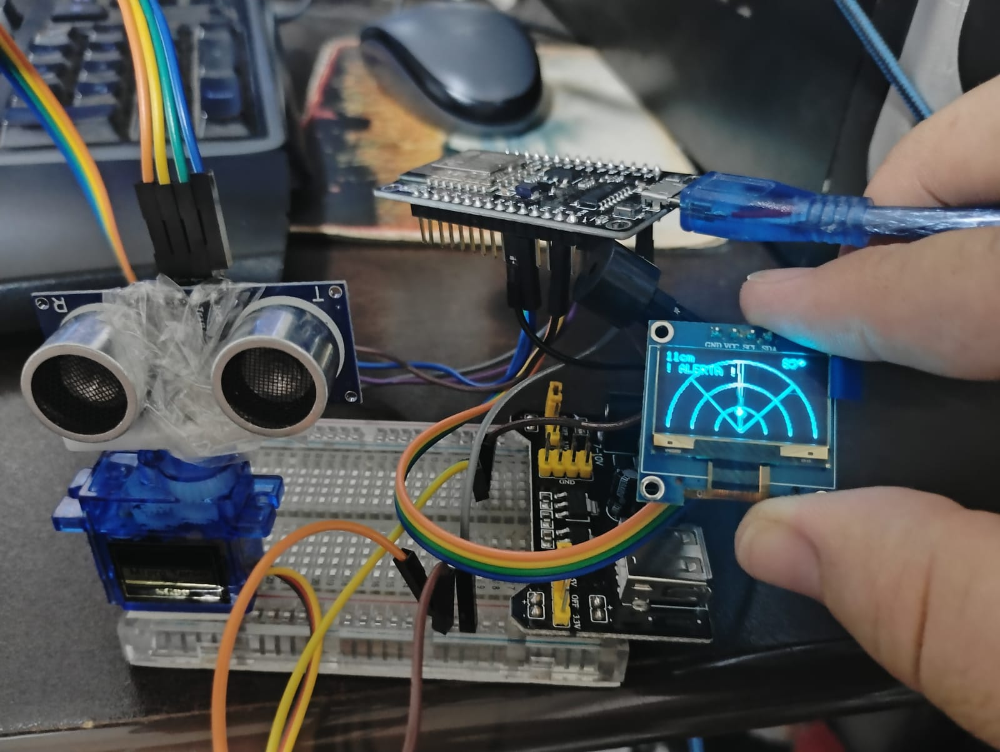

# 🎯 Radar Ultrassônico com ESP8266

Projeto de radar de varredura usando sensor ultrassônico HC-SR04, servo motor, display OLED SSD1306 e buzzer de alerta, tudo controlado por um ESP8266 (NodeMCU DevKit).

---



## 📋 O que este projeto faz

O servo motor gira continuamente de 45° a 135° (arco de 90°) carregando o sensor ultrassônico. A cada posição, o sensor mede a distância dos objetos à frente. O resultado é exibido em tempo real no display OLED como um radar — igual aos radares de filmes, com linha de varredura girando e um ponto aparecendo onde há um objeto.

Quando um objeto entra na zona de alerta (padrão: 30 cm), o buzzer começa a bipar. Quanto mais perto o objeto estiver, mais rápido os bips ficam — de 600ms de intervalo na borda do alerta até 200ms quando muito próximo.

---

## 🛒 Componentes necessários

| Componente | Quantidade | Observação |
|---|---|---|
| ESP8266 NodeMCU DevKit | 1 | Qualquer versão com pinos D0–D10 |
| Sensor ultrassônico HC-SR04 | 1 | |
| Servo motor SG90 (ou similar) | 1 | 5V, torque leve |
| Display OLED SSD1306 128x64 | 1 | Comunicação I2C, endereço 0x3C |
| Buzzer passivo ou ativo 5V | 1 | |
| Fonte de alimentação 5V externa | 1 | Mínimo 1A — **não use o 5V do USB para o servo** |
| Jumpers e protoboard | — | |
| Resistores (opcional) | 2 | 1kΩ e 2kΩ para proteção do ECHO (ver nota) |

---

## 🔌 Esquema completo de pinagem

### Display OLED SSD1306 (I2C)

| Pino do OLED | Pino ESP8266 | Observação |
|---|---|---|
| VCC | 3.3V | |
| GND | GND | |
| SDA | D2 (GPIO4) | Dados I2C |
| SCL | D1 (GPIO5) | Clock I2C |

### Sensor HC-SR04

| Pino do HC-SR04 | Pino ESP8266 | Observação |
|---|---|---|
| VCC | 3.3V | Funciona em 3.3V neste módulo |
| GND | GND | |
| TRIG | D5 (GPIO14) | Saída digital |
| ECHO | D6 (GPIO12) | Entrada digital |

### Servo Motor

| Fio do Servo | Conexão | Observação |
|---|---|---|
| Sinal (laranja/amarelo) | D7 (GPIO13) do ESP8266 | |
| VCC (vermelho) | 5V da **fonte externa** | Nunca no 5V do ESP8266 |
| GND (marrom/preto) | GND da fonte externa **E** GND do ESP8266 | ⚠️ Ver nota crítica abaixo |

### Buzzer

| Pino do Buzzer | Pino ESP8266 |
|---|---|
| + (positivo) | D8 (GPIO15) |
| - (negativo) | GND |

---

## ⚠️ Nota crítica — GND comum obrigatório

Este é o erro mais comum em projetos com fonte externa. **O GND da fonte de 5V que alimenta o servo DEVE estar conectado ao GND do ESP8266.** Sem essa ligação, o servo não recebe o sinal de controle corretamente e apresenta comportamento errático (treme, não se move, ou se move apenas de vez em quando).

```
Fonte 5V externa:
  (+5V) ──── VCC do Servo
  (GND) ──── GND do Servo
     └──────── GND do ESP8266   ← esta ligação é obrigatória!
```

---

## 📐 Diagrama de conexão resumido

```
                    ESP8266 NodeMCU
                 ┌─────────────────┐
    OLED SCL ────┤ D1   (GPIO5)    │
    OLED SDA ────┤ D2   (GPIO4)    │
                 │                 │
    HC-SR04 TRIG─┤ D5   (GPIO14)   │
    HC-SR04 ECHO─┤ D6   (GPIO12)   │
                 │                 │
    SERVO sinal──┤ D7   (GPIO13)   │
    BUZZER + ────┤ D8   (GPIO15)   │
                 │                 │
    OLED VCC ────┤ 3.3V            │
    HC-SR04 VCC──┤ 3.3V            │
                 │                 │
    GND comum ───┤ GND             │
                 └─────────────────┘

    Fonte 5V externa:
      (+) → VCC do Servo
      (-) → GND do Servo + GND do ESP8266 (obrigatório!)
```

---

## 💻 Bibliotecas necessárias

Instale todas pelo **Library Manager** da Arduino IDE (Sketch → Include Library → Manage Libraries):

| Biblioteca | Como encontrar no Library Manager |
|---|---|
| Adafruit SSD1306 | Pesquise "Adafruit SSD1306" |
| Adafruit GFX Library | Instalada automaticamente junto com SSD1306 |

> **Importante:** Este projeto **não usa a biblioteca Servo**. O controle do servo é feito via PWM nativo do ESP8266 com `analogWrite()`, o que garante compatibilidade sem instalar nada extra.

### Configuração da placa na Arduino IDE

1. Adicione o suporte ao ESP8266 em: **File → Preferences → Additional Board Manager URLs**
   ```
   https://arduino.esp8266.com/stable/package_esp8266com_index.json
   ```
2. Vá em **Tools → Board → Board Manager**, pesquise "esp8266" e instale
3. Selecione a placa: **Tools → Board → NodeMCU 1.0 (ESP-12E Module)**
4. Velocidade serial: **115200**

---

## 🚀 Como usar

1. Monte o circuito conforme o esquema de pinagem acima
2. Instale as bibliotecas necessárias
3. Abra o arquivo `radar_esp8266.ino` na Arduino IDE
4. Selecione a porta COM correta em **Tools → Port**
5. Clique em **Upload**
6. Abra o **Serial Monitor** (115200 baud) para ver os logs em tempo real

No boot, o programa executa automaticamente:
- 3 leituras de teste do sensor (você verá as distâncias no Serial)
- Movimento de teste do servo: 45° → 135° → 90°
- Um bip de confirmação
- Início da varredura contínua

---

## 🖥️ O que aparece no display OLED

```
┌────────────────────────────┐
│ 18cm          87°          │  ← distância detectada | ângulo atual
│ ! ALERTA !                 │  ← aparece quando objeto < 30cm
│      /                     │
│    /   .                   │  ← ponto = objeto detectado
│  /                         │  ← linha = varredura atual
│ (arcos concêntricos)       │  ← grade do radar
└────────────────────────────┘
```

Os 3 arcos representam, do centro para fora: ~13cm, ~27cm e ~40cm de distância.

---

## ⚙️ Ajustes disponíveis no código

Todas as configurações estão no início do arquivo, fáceis de localizar:

```cpp
// Ângulo de varredura
const int MIN_ANGLE  = 45;    // Ângulo mínimo (padrão: 45°)
const int MAX_ANGLE  = 135;   // Ângulo máximo (padrão: 135°)
                               // Para varredura total: MIN=0, MAX=180

// Zona de alerta
const int ALERT_CM   = 30;    // Distância máxima de alerta em cm
const int ALERT_MIN  = 5;     // Distância mínima (bip mais rápido)

// Velocidade dos bips
const int BIP_MAX_MS = 600;   // Intervalo em ms quando objeto está a ALERT_CM
const int BIP_MIN_MS = 200;   // Intervalo em ms quando objeto está a ALERT_MIN

// Velocidade do servo (no loop principal)
delay(40);  // Aumente para o servo girar mais devagar, diminua para mais rápido
```

---

## 📊 Como funciona o buzzer progressivo

O intervalo entre os bips é calculado automaticamente com base na distância do objeto:

```
Distância 30cm → intervalo 600ms (bips lentos)
Distância 17cm → intervalo ~400ms (bips médios)
Distância  5cm → intervalo 200ms (bips rápidos)
Distância  0cm → intervalo 200ms (mínimo)
```

O buzzer para automaticamente quando o objeto sai da zona de alerta.

---

## 🔍 Leitura do Serial Monitor

Durante o funcionamento, o Serial Monitor exibe uma linha por posição varrida:

```
[45g] sem eco              ← sem objeto detectado neste ângulo
[47g] 62 cm                ← objeto a 62cm (fora do alerta)
[49g] 18 cm  ALERTA | intervalo bip: 440ms   ← objeto em alerta!
[51g] 12 cm  ALERTA | intervalo bip: 320ms   ← mais próximo, bip mais rápido
```

---

## ❓ Problemas comuns

| Sintoma | Causa provável | Solução |
|---|---|---|
| Display em branco | Endereço I2C errado | Troque `0x3C` por `0x3D` no código |
| Servo não se move ou treme | GND da fonte externa não conectado ao ESP8266 | Ligue o GND da fonte ao GND do ESP8266 |
| Servo se move só no boot | Fonte externa insuficiente | Use fonte de pelo menos 1A |
| Sensor retorna "sem eco" sempre | Cabos TRIG/ECHO invertidos ou soltos | Verifique TRIG→D5 e ECHO→D6 |
| ESP8266 reinicia sozinho | Corrente insuficiente pelo USB | Ligue a fonte externa e compartilhe o GND |
| Buzzer não para de bipar | `distance` nunca sai do alerta | Verifique leitura do sensor no Serial Monitor |

---

## 🙏 Créditos e Agradecimentos

Este projeto é uma adaptação do **"Duck Radar"**, criado pelo Redditor **Fpr** e divulgado no Hackster.io por **Nick Bild**.

O projeto original utilizava um **Arduino** com sensor ultrassônico HC-SR04 e display OLED, com o código compartilhado diretamente nos comentários do Reddit. A ideia central — girar um sensor ultrassônico com um servo e exibir os resultados em estilo radar — é inteiramente de Fpr.

**O que foi mantido desta versão:**
- Conceito e lógica central do radar
- Algoritmo de varredura ping-pong (45°–135°)
- Renderização gráfica no display OLED

**O que foi adicionado/adaptado nesta versão:**
- Portado de Arduino para **ESP8266 NodeMCU**
- Controle de servo via **PWM nativo** do ESP8266 (sem biblioteca Servo)
- **Buzzer de alerta progressivo** — intervalo entre bips diminui conforme o objeto se aproxima
- Logs detalhados via Serial Monitor para diagnóstico
- Rotina de teste automático no boot

**Referências:**
- 📰 Artigo no Hackster.io: [Map Your Room with This "Radar" Scanner](https://www.hackster.io/news/map-your-room-with-this-radar-scanner-f2bbde284ecb)
- 💬 Projeto original no Reddit: [r/arduino — Duck Radar](https://www.reddit.com/r/arduino/comments/1r7c7ag/duck_radar/)
- ✍️ Artigo escrito por: Nick Bild (Hackster.io)
- 🛠️ Projeto original por: Fpr (Reddit)

---